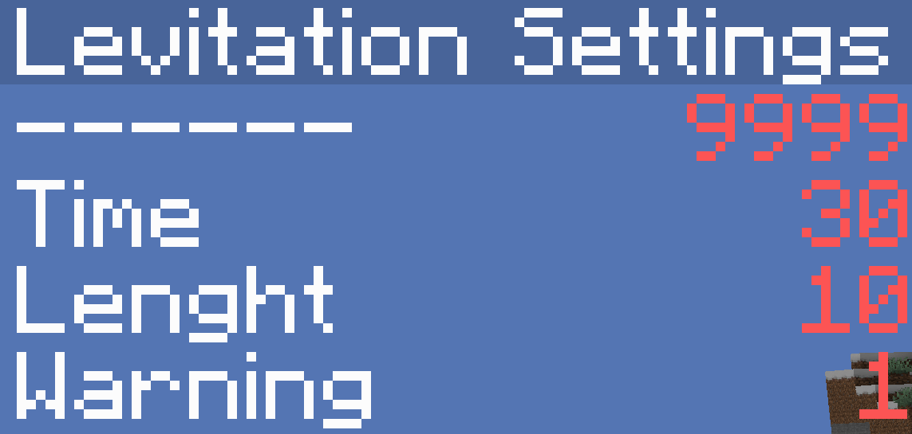

# Levitation Challenge

Just a simple challenge datapack I made for me and my friend, don't expect anything super polished.

**What is the challenge?**

This is a pretty simple Minecraft challenge, try to complete the game, but every `Time` seconds, you get the levitation effect for `Lenght` seconds.

If `Warning` is set to 1, you will get warned about 10 seconds before the levitation.

Its actually pretty fun!

**How to use:**

1. Install the datapack
2. Change settings in the `levSettings` scoreboard.
3. Add players by giving them the tag `levPlayer`,  `/tag UserName add levPlayer` 
4. Remove players by removing their tag, `/tag UserName remove levPlayer`
5. Enjoy!

